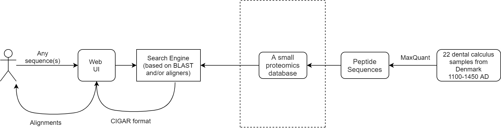

# TRACK Tracking ancient global epidemics
Team leads: Rays Jiang and Minh Pham

## Complete pipeline:


## Simplified pipeline:


## INSTALLATION
###	web server
Install requirements:
```
sudo apt install python3 python3-pip
pip3 install flask
```
Set up the web app service: 
```
sudo python3 ./server_setup.py
sudo systemctl daemon-reload
```

Check if the app is running
`systemctl status TRACK-flask.service`

### search engine
```
cd search_engine
wget ftp://ftp.ncbi.nlm.nih.gov/blast/executables/blast+/LATEST/ncbi-blast-2.10.0+-x64-linux.tar.gz
gunzip ncbi-blast-2.10.0+-x64-linux.tar.gz
tar -xf ncbi-blast-2.10.0+-x64-linux.tar
cp ./ncbi-blast-2.10.0+/bin/* ./
```

### database
The database's FASTA file is static .Set up the database from FASTA file:
```
cd database 
../search_engine/makeblastdb -in demo.fasta -blastdb_version 5 -title "TRACK data" -dbtype prot
```
To run search engine
```
./blastp -query query.faa -db demo.fasta -out blast_results.txt
```
